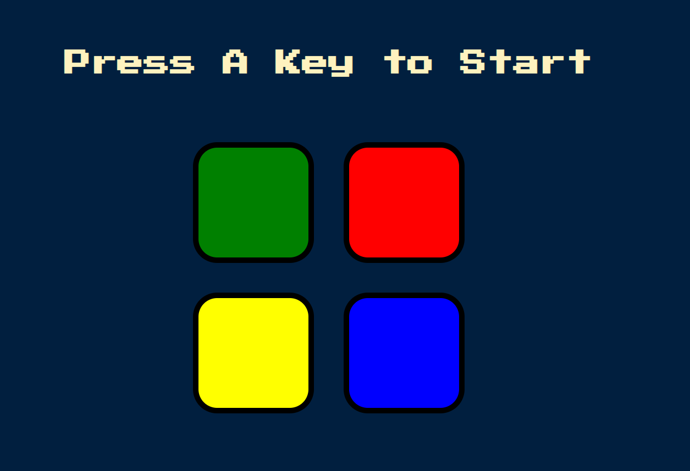
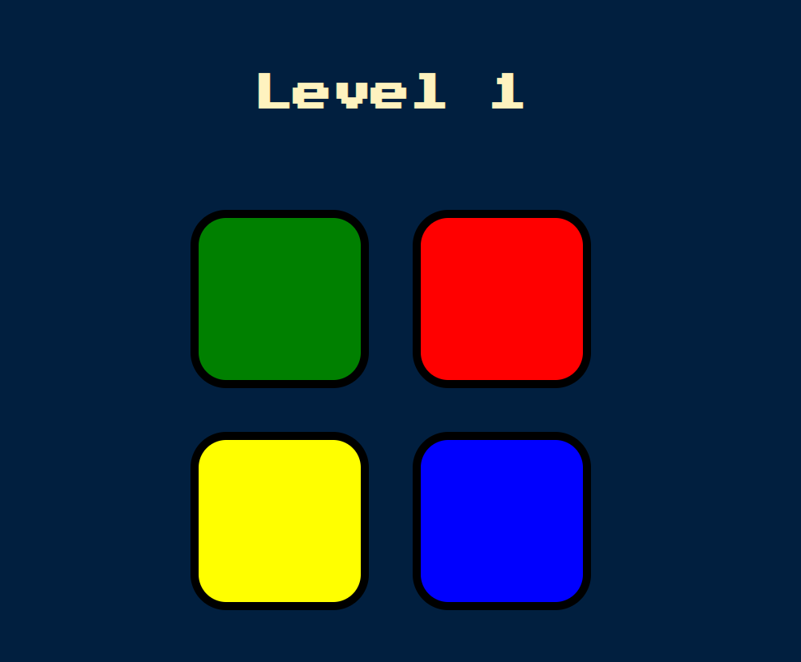
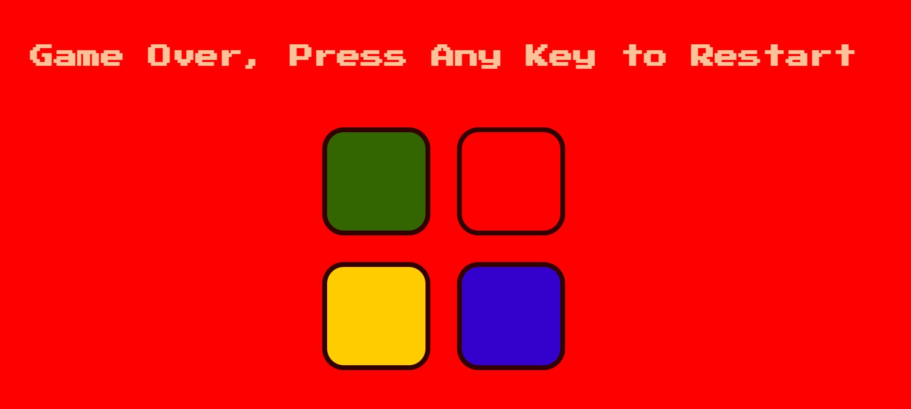

# Simon Game

Welcome to my Simon Game repository! This is a simple and fun memory game built using HTML, CSS, and JavaScript. The game is inspired by the classic Simon electronic game from the 1980s.

## How to Play

The goal of the Simon Game is to repeat a sequence of colors and sounds as accurately as possible. The game starts with a sequence of colors being displayed and played in a specific order. You must then repeat the sequence by clicking on the colors in the same order.

The game starts with a single color and adds one additional color to the sequence each time the player successfully completes a round. If you make a mistake and click the wrong color, the game ends.

## Features

- Simple and intuitive gameplay
- Increasing difficulty as the game progresses
- Sound effects to enhance the gaming experience

## Technologies Used

- HTML
- CSS
- JavaScript

## Vidhi Harwani 
